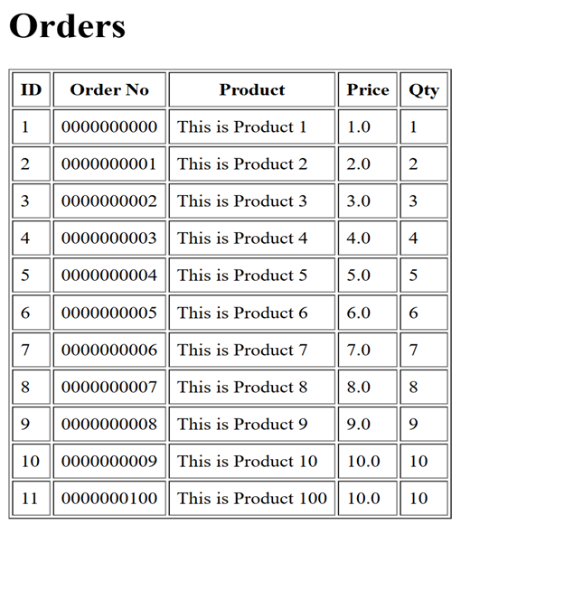
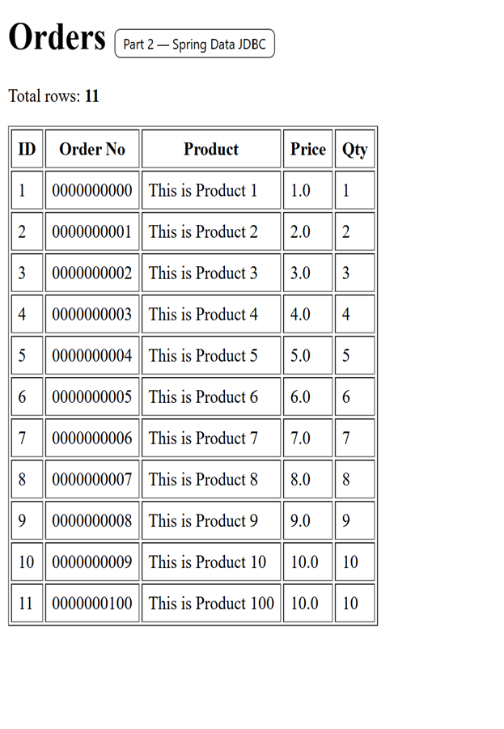
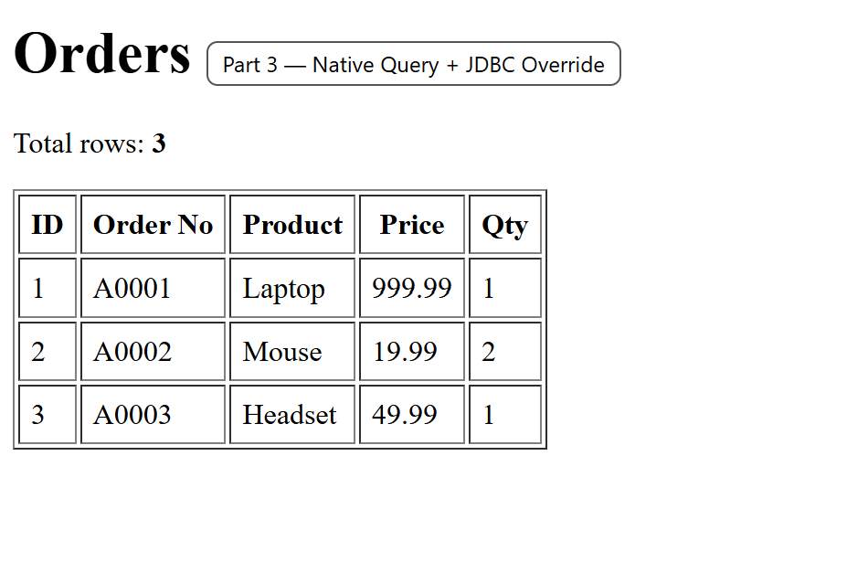

**Name:Devin Puckett**  
**Course:Cst-339**  
**Date:09/17/2025** 

**Professor:Bobby Estey**

---

## 1) Shows Home Page

This is my WinForms DataGridView after I bound the List that was loaded from Topic6.txt. The columns are ID, Order No, Product, Price, and Qty, and I formatted the headers and numbers so Price shows with a single decimal and Qty is aligned cleanly. The Order No values are zero-padded to check that my display formatting works. 
---

## 2) Spring Data JDBC Orders Page

This is my Orders web page from Part 2,  Spring Data JDBC. The table is an HTML/Thymeleaf view that lists rows returned from the database through my Spring Data JDBC repository. The page shows Total rows: 11, confirming the query worked, and displays the columns ID, zero-padded Order No, Product, Price, and Qty. This proves the end-to-end path is wired up: repository to controller to template to browser, with the formatting applied in the view.
---

## 3) Shows Updated Register Page

This is my Orders web page for Part 3, Native Query + JDBC Override. The table is an HTML/Thymeleaf view that shows the 3 rows returned by my native SQL query, which I wired through a Spring Data JDBC repository with a JDBC override/mapper to shape the result. The Total rows: 3 at the top confirms the custom query ran correctly end-to-end: repository to controller to template to browser. The columns display ID, Order No A0001 style, Product, Price with two decimals, and Qty, proving the formatting and mapping are working. 
---
